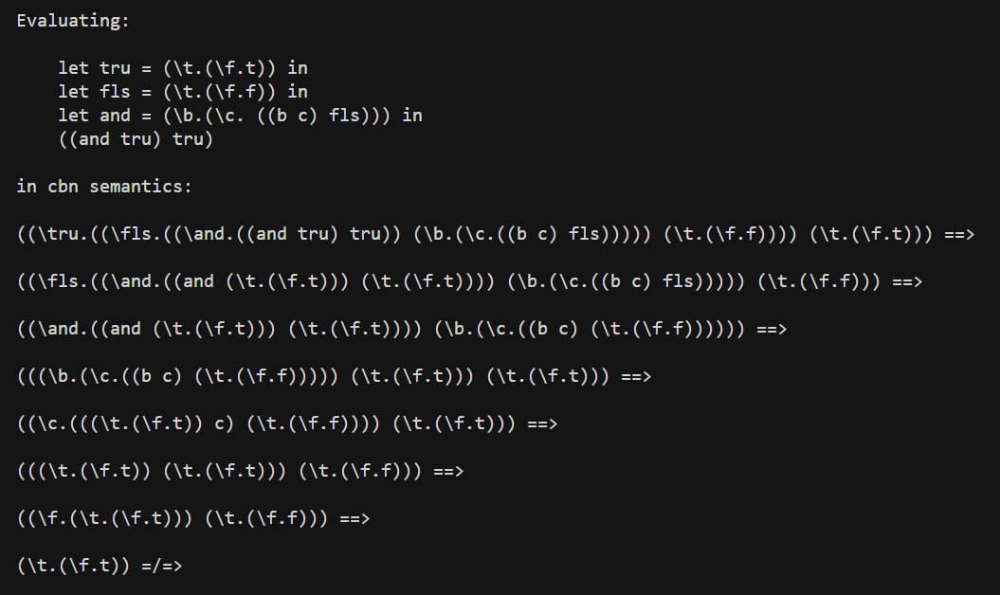
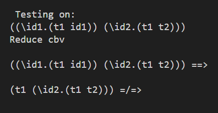

# lambda-calculus-rust
💻 Rust implementation of the untyped lambda calculus with Call-by-Value (CBV) and Call-by-Name (CBN) reduction semantics

## Table of Contents  

1. [About](#about)  
2. [Features](#features)  
3. [Requirements](#requirements)  
4. [Installation](#installation)  
5. [Usage](#usage)  

---

## About  

This project implements a small **lambda calculus** interpreter in Rust. Programs are parsed into an abstract syntax tree and reduced step-by-step using either **Call-by-Value** or **Call-by-Name** operational semantics. Each reduction step is printed so you can follow the evaluation trace.

---

## Features  

- **Lexer & Parser** – Tokenizes and parses lambda terms, including `let … in` bindings.
- **Abstract Syntax Tree** – Algebraic data types for variables, abstractions, and applications.
- **Substitution** – Capture-avoiding substitution with fresh variable generation.
- **Call-by-Value (CBV)** – Reduces arguments to values before applying abstractions (`E-App1`, `E-App2`, `E-AppAbs`).
- **Call-by-Name (CBN)** – Substitutes arguments directly without evaluating them first.
- **Demo Programs** – Built-in examples covering Church booleans, logical operators, identity, and fixed-point-style terms.

---

## Requirements

- **Rust** (1.70 or higher recommended) – Install via [rustup](https://rustup.rs/).
- **Cargo** – Included with the Rust toolchain.
- **Git** – Required for cloning the repository.

---

## Installation

### 1. Clone the repository
```bash
git clone https://github.com/Amit-Bruhim/lambda-calculus-rust.git
```

### 2. Navigate into the project folder
```bash
cd lambda-calculus-rust
```

### 3. Build the project
```bash
cargo build
```

---

## Usage  

Run the built-in demo suite:

```bash
cargo run
```

This executes **nine named demo programs** in one run. Each demo prints the source term and its step-by-step reduction trace.

| Demo | What it shows |
|------|----------------|
| Church `and` (CBN) | `(and tru tru)` reduces under Call-by-Name |
| Church `and` (CBV) | `(and fls tru)` reduces under Call-by-Value |
| Identity application | `(λid1. t1 id1) (λid2. t1 t2)` — CBV vs CBN |
| Shadowing | `(λid1. t1 id1) (λid1. t1)` under CBV |
| Church `not` + `and` | `((not and) fls tru)` — CBV vs CBN |
| Identity combinator | `(λx. x) (λy. y)` under CBN |
| Omega-style term | `(λx. λy. y) Ω` under CBN |
| Church numeral 2 | `(λf. λx. f (f x)) (λid. id)` under CBN |

For example:

- **Church `and tru tru` (CBN)** — `let` bindings and step-by-step Call-by-Name reduction



- **Identity application (CBV)** — `(λid1. t1 id1) (λid2. t1 t2)` reduces the argument before applying



